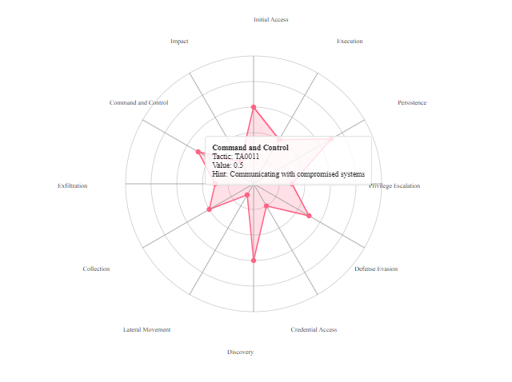

# Fix labels and tooltips - Claude 3.5 ( Sonnet )

## Prompt

lets change the data a bit

```json
const data = [ 
   { tactic: "TA0001: Initial Access", value: 0.6 }, 
   { tactic: "TA0002: Execution", value: 0.4 }, 
   { tactic: "TA0003: Persistence", value: 0.7 }, 
   { tactic: "TA0004: Privilege Escalation", value: 0.3 }, 
   { tactic: "TA0005: Defense Evasion", value: 0.5 }, 
   { tactic: "TA0006: Credential Access", value: 0.2 }, 
   { tactic: "TA0007: Discovery", value: 0.6 }, 
   { tactic: "TA0008: Lateral Movement", value: 0.1 }, 
   { tactic: "TA0009: Collection", value: 0.4 }, 
   { tactic: "TA0010: Exfiltration", value: 0.3 }, 
   { tactic: "TA0011: Command and Control", value: 0.5 }, 
   { tactic: "TA0040: Impact", value: 0.2 } ];
```

lets make "Tactic" be just the TAxxxx part and Lable be the name.  For example:  "Tactic":"TA0008", "label": "Lateral Movement"

the graph will just show the lable, but a tooltip will show the value and the tactic.  If you want to add a comment, or hint too that only shows in the tool tip thats fun

## Result

Code <https://jsfiddle.net/624ocLhy/3/>



Certainly! I'll modify the data structure and update the chart to include tooltips with the additional information. This will make the chart cleaner while still providing detailed information on hover.

## Reply

I've made several changes to implement your requests:

1. Updated the data structure:

   ```javascript
   const data = [
       { tactic: "TA0001", label: "Initial Access", value: 0.6, hint: "The point of entry for an attack" },
       // ... other data points
   ];
   ```

2. Modified the label display to show only the name:

   ```javascript
   .text(d => d.label)
   ```

3. Added tooltips with detailed information:
   - Created a tooltip div in the HTML.
   - Added CSS for the tooltip.
   - Implemented mouseover and mouseout events on the data points to show/hide the tooltip.

4. The tooltip now displays:
   - The label (tactic name)
   - The tactic code (TAxxxx)
   - The value
   - A hint or comment about the tactic

Here's a breakdown of the main changes:

1. Data structure update:

   ```javascript
   const data = [
       { tactic: "TA0001", label: "Initial Access", value: 0.6, hint: "The point of entry for an attack" },
       // ... other data points
   ];
   ```

2. Tooltip CSS:

   ```css
   .tooltip {
       position: absolute;
       background-color: rgba(255, 255, 255, 0.9);
       border: 1px solid #ddd;
       padding: 10px;
       border-radius: 5px;
       pointer-events: none;
       font-size: 12px;
   }
   ```

3. Tooltip functionality:

   ```javascript
   .on("mouseover", function(event, d) {
       tooltip.transition()
           .duration(200)
           .style("opacity", .9);
       tooltip.html(`<strong>${d.label}</strong><br/>
                     Tactic: ${d.tactic}<br/>
                     Value: ${d.value}<br/>
                     Hint: ${d.hint}`)
           .style("left", (event.pageX + 10) + "px")
           .style("top", (event.pageY - 28) + "px");
   })
   .on("mouseout", function(d) {
       tooltip.transition()
           .duration(500)
           .style("opacity", 0);
   });
   ```

These changes result in a cleaner chart with labels showing only the tactic names, while providing detailed information (including the TAxxxx code, value, and a hint) in tooltips that appear when hovering over the data points.

Is there anything else you'd like me to modify or explain about this updated chart?
