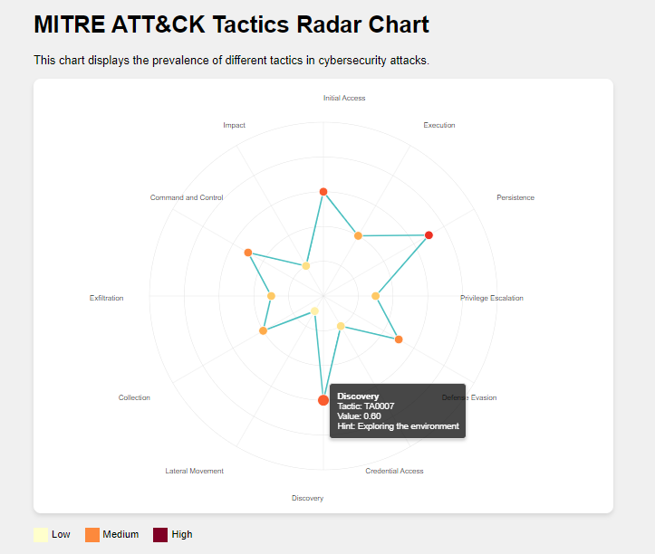

# Make Better - Claude 3.5 ( Sonnet )

## Prompt

so what you do to make this better

## Result

Code: <https://jsfiddle.net/624ocLhy/5/>

## Reply

To further improve this chart, we could consider several enhancements:

1. Add interactivity:

   - Implement zooming and panning capabilities to allow users to focus on specific areas of the chart.
   - Create clickable segments that could show more detailed information about each tactic.

2. Improve accessibility:

   - Add ARIA labels for screen readers.
   - Ensure proper color contrast for all elements.

3. Enhance data visualization:

   - Implement a color scale to represent values instead of just using dot size.
   - Add the option to compare multiple datasets on the same chart.

4. Improve responsiveness:

   - Make the chart responsive to different screen sizes.

5. Add more context:
   - Include a legend explaining the meaning of the values.
   - Add a brief description or title for the chart.

Let's implement some of these improvements:

Here are the key improvements I've made:

1. Responsive design:

   - Used SVG viewBox for better responsiveness.
   - Made the chart container fluid with a max-width.

2. Enhanced data visualization:

   - Implemented a color scale (yellow to red) to represent values.
   - Added a legend to explain the color scale.

3. Improved interactivity:

   - Dots now enlarge slightly on hover for better feedback.

4. Added context:

   - Included a title and brief description for the chart.

5. Accessibility improvements:

   - Better color contrast for the dots (added white stroke).
   - Larger font size for better readability.

6. Code structure:
   - Separated styles into a `<style>` tag for better organization.

These changes result in a more informative, interactive, and accessible chart while maintaining its sleek design. The color scale provides an immediate visual cue for the values, and the legend helps users interpret the data more easily.

To further improve this chart, we could:

1. Implement zooming and panning functionality.
2. Add animation for transitions when hovering over data points.
3. Create a toggle to switch between different datasets or time periods.
4. Implement keyboard navigation for better accessibility.
5. Add options to customize the color scheme or chart layout.

Would you like me to implement any of these additional features or make any other adjustments to the chart?
