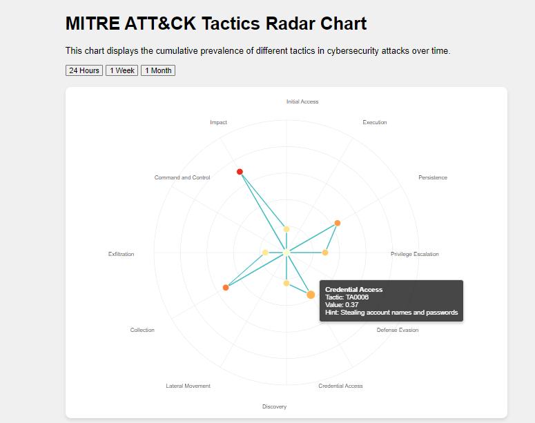

# Datasets - Claude 3.5 ( Sonnet )

## Prompt

Lets go with the multiple datasets
I would like 3 datasets.
24 hour
1 week
1 month

note...these are culmultive values.  They represent tactics that are detected over time

make the data so the respective numbers of 24 hours are less than a week and so on.

make the data a bit sparse though.  Leave like 4 tactics with 0 for the whole month.  Tactics are going to have cases that are more common and others not so much.  its not an even distribution

animation for transitions should be nice too

## Result

code: https://jsfiddle.net/624ocLhy/6/

## Reply

Certainly! I'll create three datasets representing 24 hours, 1 week, and 1 month of cumulative tactic detections, with some tactics having no detections throughout. I'll also add animation for transitions between datasets. Let's implement these changes:

 

Here are the key improvements and changes I've made:

1. Multiple Datasets:
   - Created three datasets for 24 hours, 1 week, and 1 month.
   - Ensured cumulative values increase over time.
   - Made the data sparse by setting some tactics to 0 for all time periods.

2. Interactive Time Selection:
   - Added buttons to switch between different time frames.

3. Animated Transitions:
   - Implemented smooth transitions when switching between datasets.

4. Data Generation:
   - Created random but realistic data for each time frame.
   - Ensured some tactics (4 of them) have 0 detections across all time frames.

5. Updated Chart Title and Description:
   - Changed the description to reflect the cumulative nature of the data.

6. Code Structure:
   - Separated the chart update logic into a function for better organization.

Here's a brief explanation of how the data is generated and structured:

1. We start with a base set of tactics.
2. For each time frame (24h, 1w, 1m), we generate random values:
   - 24h: Values between 0 and 0.3, with a 40% chance of being 0.
   - 1w: Values between 0 and 0.6, with a 50% chance of being 0.
   - 1m: Values between 0 and 0.9, with a 60% chance of being 0.
3. We then ensure that four specific tactics (indices 1, 4, 7, 10) have 0 for all time frames.
4. Finally, we adjust the values to ensure they are cumulative (1w >= 24h, 1m >= 1w).

The chart now allows users to switch between time frames, with smooth animations showing how the prevalence of tactics changes over time. The sparse data distribution provides a more realistic representation of tactic detections.

Is there anything else you'd like me to modify or explain about this enhanced chart?