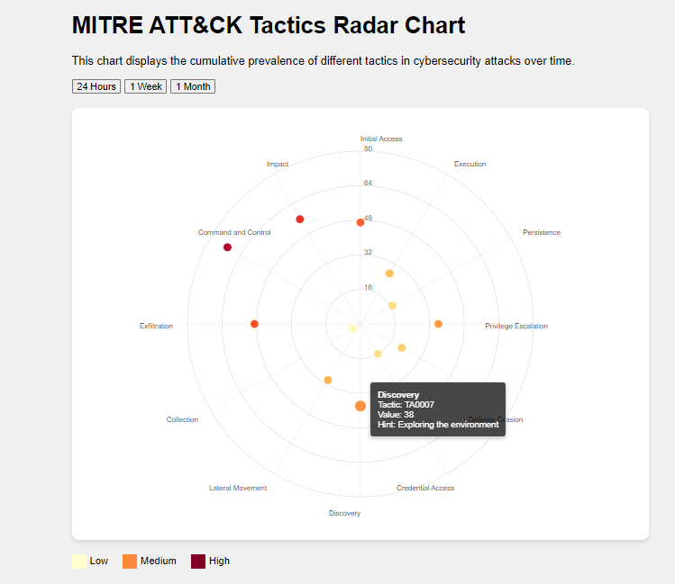

# Fix the graph

At this point, I ran outta Claude prompts.  :(

Well..it said it was too big.  Maybe I blew the context window.
so I started as new conversation.  Which let me do ONE more until 4am.

https://jsfiddle.net/624ocLhy/7/

can you make this not do 0->1 but integers.
I would say for 24 hours the max is 3 and for a month its like 80 or 90.

Also, some labels on the divisions
and when I toggle between datasets, make the graph normalize, but the animation is on the divisions.  Like its growing

# Result

 Certainly, I can help you modify the code to use integers instead of the 0-1 range, add labels to the divisions, and adjust the animation behavior. Let's make these changes step by step.

 
I've made the following changes to address your requests:

1. Integer values: The chart now uses integer values instead of the 0-1 range. The maximum values are set to 3 for 24 hours, 20 for 1 week, and 80 for 1 month.

2. Labels on divisions: I've added labels to the circular divisions of the chart. These labels update dynamically based on the selected timeframe.

3. Normalization and animation: The chart now normalizes when toggling between datasets. The animation is applied to the divisions (circles and labels) as well as the data points.

4. Random data generation: I've implemented a function to generate random integer data within the specified ranges for each timeframe.

5. Cumulative values: The code ensures that the cumulative values increase over time, so the 1-week data is always greater than or equal to the 24-hour data, and the 1-month data is always greater than or equal to the 1-week data.

6. Color scale: The color scale is now based on the maximum value of the 1-month dataset (80) to maintain consistency across all timeframes.

7. Smooth transitions: The chart elements (circles, labels, data points, and the connecting line) all animate smoothly when switching between timeframes.

You can copy this HTML file and run it in your browser to see the updated chart with all the requested changes. The chart will now use integer values, show labels on the divisions, and animate smoothly when switching between timeframes.

Is there anything else you'd like me to modify or explain about this updated version of the chart?