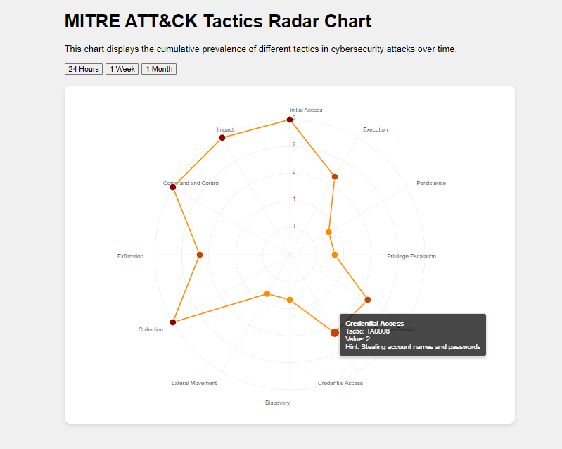

# Fix in Chat

Moved to ChatGPT o1-preview.  Im paying for this...so why not.
Preview might have been overkill

code: https://jsfiddle.net/624ocLhy/8/

## Prompt

its looking good but a few things

lets ditch the legend, its not doing much

it used to connect the lines between the nodes.  I would like that back

The color scale goes from yellow to dark red.  low numbers are hard to see.  Lets just scale it from a medium dark orange to dark red.

also, scale the colors to the range.  In this case...all values in 24 were relatively low so they were all yellow.  normalize appropriately.

## Result

 Certainly! I've made the requested changes to your code:

1. **Removed the legend** since it wasn't contributing much to the visualization.
2. **Restored the connecting lines between the nodes** to make the chart more coherent.
3. **Adjusted the color scale** to range from medium dark orange to dark red.
4. **Normalized the color scale to the current data range** to ensure better visibility across different timeframes.

Below is the updated code with explanations:
 
### Explanation of Changes:

1. **Removed the Legend**:

   - **HTML**: Deleted the `

` element since it's no longer needed.
   - **CSS**: Removed all styles related to `.legend`, `.legend-item`, and `.legend-color`.
   - **JavaScript**: Eliminated the code block that generated the legend.

2. **Restored the Connecting Lines**:

   - Ensured that the `path` element is properly initialized and updated.
   - In the `updateChart` function, updated the `path` to draw the lines between nodes using the `line` generator.
   - Adjusted the `fill` and `stroke` attributes of the `path` for better visibility.

3. **Adjusted the Color Scale**:

   - Removed the fixed `colorScale` definition that was tied to the maximum value of the '1m' dataset.
   - In the `updateChart` function, dynamically defined `colorScale` based on the current data range (`minValue` to `maxValueInData`).
   - Used `d3.scaleLinear()` with a custom color range from medium dark orange (`#FF8C00`) to dark red (`#8B0000`).

4. **Normalized Colors to the Current Data Range**:

   - Calculated the `minValue` and `maxValueInData` for the current timeframe's data.
   - Adjusted the `colorScale` domain to `[minValue, maxValueInData]` to ensure that the colors are appropriately scaled for each timeframe.
   - This ensures that even if all values are low in the '24h' timeframe, they will still be visible and appropriately colored.

### Notes:

- **Tooltip Functionality**: The tooltip remains functional, providing detailed information on hover.
- **Transitions**: Added smooth transitions for both the path and dots when the data updates.
- **Scales and Axes**: Updated scales and axes to reflect the current data, ensuring the chart remains accurate and readable.

By making these changes, the radar chart now:

- Excludes the legend for a cleaner look.
- Properly connects the data points with lines.
- Uses a more suitable color range that enhances visibility of all data points.
- Dynamically adjusts colors based on the data range, improving clarity across different timeframes.

Feel free to further customize the colors or any other aspect to better suit your preferences!