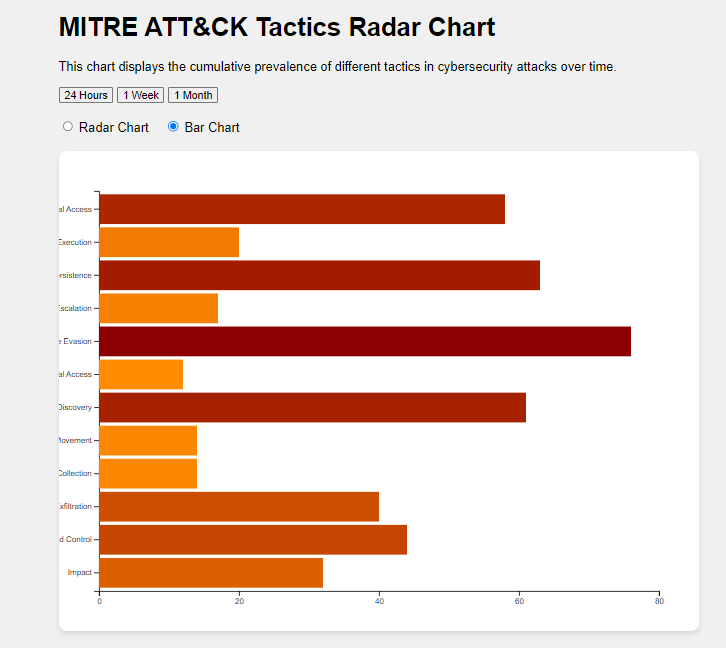

# Combo

## prompt

Lets go crazy.

make it so that there is a toggle to toggle between the radar chart as we see it and a horizontal bar chart

## Result

code: <https://jsfiddle.net/624ocLhy/9/>




## Reply

That sounds exciting! Let's implement a toggle that allows users to switch between the radar chart and a horizontal bar chart. This will provide users with two different visualizations of the same data, enhancing their ability to interpret the information.

### Overview of the Changes

1. **Add a Toggle Button**: We'll include a button or a set of radio buttons to switch between the two chart types.
2. **Modify the HTML Structure**: Ensure both charts can be displayed in the same container.
3. **Implement Bar Chart Rendering**: Use D3.js to create a horizontal bar chart using the same data.
4. **Add Logic to Switch Between Charts**: Show or hide charts based on the selected option.
5. **Ensure Responsiveness**: Both charts should adapt to the container size.

### Step-by-Step Implementation

#### 1. Update the HTML

Add radio buttons for toggling between the radar chart and the bar chart.

```html
<!-- Add this inside the #chart-container div, above the chart div -->
<div id="chart-type-selector">
  <label>
    <input
      type="radio"
      name="chartType"
      value="radar"
      checked
      onchange="toggleChart(this.value)"
    />
    Radar Chart
  </label>
  <label>
    <input
      type="radio"
      name="chartType"
      value="bar"
      onchange="toggleChart(this.value)"
    />
    Bar Chart
  </label>
</div>
```

#### 2. Update the CSS

Adjust styles for the new elements and ensure charts are appropriately displayed.

```css
/* Add styles for the chart type selector */
#chart-type-selector {
  margin-bottom: 20px;
}
#chart-type-selector label {
  margin-right: 15px;
}
```

#### 3. Update the JavaScript

We'll need to modify the script to:

- Initialize both charts.
- Define functions to update each chart.
- Add a function to toggle between the charts.

Here's the updated script with detailed explanations:
See Code

#### 4. Update the Timeframe Buttons

Modify the timeframe buttons to use the new `updateTimeframe` function.

```html
<div id="timeframe-selector">
  <button onclick="updateTimeframe('24h')">24 Hours</button>
  <button onclick="updateTimeframe('1w')">1 Week</button>
  <button onclick="updateTimeframe('1m')">1 Month</button>
</div>
```

#### 5. Explanation of the Changes

- **HTML**:

  - Added a chart type selector with radio buttons to toggle between "Radar Chart" and "Bar Chart".
  - Adjusted the timeframe buttons to call `updateTimeframe` instead of `updateChart`.

- **CSS**:

  - Added styles for the chart type selector.

- **JavaScript**:
  - **Variables and Groups**:
    - Created `radarGroup` and `barGroup` within the main SVG to hold the radar chart and bar chart elements, respectively.
    - Set `barGroup` to be hidden initially using `style("display", "none")`.
  - **State Management**:
    - Introduced `currentChartType` to keep track of which chart is currently displayed.
    - Introduced `currentTimeframe` to keep track of the selected timeframe.
  - **Functions**:
    - **drawRadarChart**: Renders the radar chart within `radarGroup`.
      - Clears previous content before rendering new elements.
      - Updates scales and color scales based on the data.
    - **drawBarChart**: Renders the bar chart within `barGroup`.
      - Similar to `drawRadarChart`, it clears previous content and updates scales.
      - Draws bars using rectangles and adds axes.
    - **updateChart**: Decides which chart to update based on `currentChartType` and calls the appropriate function.
    - **toggleChart**: Shows or hides `radarGroup` and `barGroup` based on the selected chart type.
    - **updateTimeframe**: Updates `currentTimeframe` and calls `updateChart` to refresh the data.

#### 6. Test the Implementation

Make sure to test the toggle functionality by:

- Switching between the radar chart and the bar chart using the radio buttons.
- Changing the timeframe to see if both charts update accordingly.
- Hovering over data points or bars to check if the tooltips display correctly.

#### 7. Additional Enhancements

- **Transitions**: Add transitions to the bar chart for smoother updates.

  ```javascript
  // In drawBarChart function, modify the bars to include transitions
  barGroup
    .selectAll(".bar")
    .data(data)
    .join(
      (enter) =>
        enter
          .append("rect")
          .attr("class", "bar")
          .attr("y", (d) => yScaleBar(d.label))
          .attr("height", yScaleBar.bandwidth())
          .attr("x", 0)
          .attr("width", 0) // Start width at 0 for transition
          .attr("fill", (d) => colorScale(d.value))
          .call((enter) =>
            enter
              .transition()
              .duration(1000)
              .attr("width", (d) => xScaleBar(d.value))
          ),
      (update) =>
        update.call((update) =>
          update
            .transition()
            .duration(1000)
            .attr("width", (d) => xScaleBar(d.value))
            .attr("fill", (d) => colorScale(d.value))
        )
    )
    .on("mouseover" /* ... */);
  ```

- **Axis Labels**: Add labels to the axes in the bar chart for clarity.

  ```javascript
  // After drawing axes in drawBarChart function
  // X-axis label
  barGroup
    .append("text")
    .attr("class", "x-axis-label")
    .attr("x", (width - 100) / 2)
    .attr("y", height - 60)
    .attr("text-anchor", "middle")
    .text("Value")
    .attr("font-size", "12px")
    .attr("fill", "#333");

  // Y-axis label (optional)
  ```

- **Responsive Design**: Ensure that the charts resize based on the container size.

  - Adjust the `width` and `height` variables based on the container's dimensions.
  - Use `viewBox` and `preserveAspectRatio` to make the SVG responsive.

#### 8. Full Updated Code

Below is the full updated code incorporating all the changes:

```html
<!DOCTYPE html>
<html lang="en">
  <head>
    <meta charset="UTF-8" />
    <title>MITRE ATT&CK Tactics Chart Toggle</title>
    <script src="https://d3js.org/d3.v7.min.js"></script>
    <style>
      body {
        font-family: Arial, sans-serif;
        background-color: #f0f0f0;
        margin: 0;
        padding: 20px;
      }
      #chart-container {
        max-width: 800px;
        margin: 0 auto;
      }
      #chart {
        width: 100%;
        height: 600px;
        background-color: white;
        border-radius: 10px;
        box-shadow: 0 4px 6px rgba(0, 0, 0, 0.1);
      }
      .tooltip {
        position: absolute;
        background-color: rgba(0, 0, 0, 0.8);
        color: white;
        border: 1px solid #ddd;
        padding: 10px;
        border-radius: 5px;
        pointer-events: none;
        font-size: 12px;
        box-shadow: 0 2px 4px rgba(0, 0, 0, 0.2);
      }
      #timeframe-selector {
        margin-bottom: 20px;
      }
      /* Styles for the chart type selector */
      #chart-type-selector {
        margin-bottom: 20px;
      }
      #chart-type-selector label {
        margin-right: 15px;
      }
    </style>
  </head>
  <body>
    <div id="chart-container">
      <h1>MITRE ATT&CK Tactics Chart Toggle</h1>
      <p>
        This chart displays the cumulative prevalence of different tactics in
        cybersecurity attacks over time.
      </p>
      <div id="timeframe-selector">
        <button onclick="updateTimeframe('24h')">24 Hours</button>
        <button onclick="updateTimeframe('1w')">1 Week</button>
        <button onclick="updateTimeframe('1m')">1 Month</button>
      </div>
      <!-- Chart type selector -->
      <div id="chart-type-selector">
        <label>
          <input
            type="radio"
            name="chartType"
            value="radar"
            checked
            onchange="toggleChart(this.value)"
          />
          Radar Chart
        </label>
        <label>
          <input
            type="radio"
            name="chartType"
            value="bar"
            onchange="toggleChart(this.value)"
          />
          Bar Chart
        </label>
      </div>
      <div id="chart"></div>
    </div>
    <script>
      // [Insert the JavaScript code from the previous step here]
      // Be sure to include all the code provided in the previous JavaScript section.
    </script>
  </body>
</html>
```

### Notes

- **Data Consistency**: Both charts use the same data, ensuring consistency in the information presented.
- **User Experience**: The toggle provides an interactive way for users to view the data in different formats, catering to different preferences.
- **Scalability**: The code structure allows for easy addition of more chart types in the future if desired.

### Conclusion

By adding a toggle between the radar chart and a horizontal bar chart, you've enhanced the interactivity and utility of your visualization. Users can now choose the chart type that best helps them understand the data.

Feel free to further customize the charts, such as adjusting colors, adding more interactive features, or integrating additional data sources. If you have any questions or need assistance with further modifications, I'm here to help!
