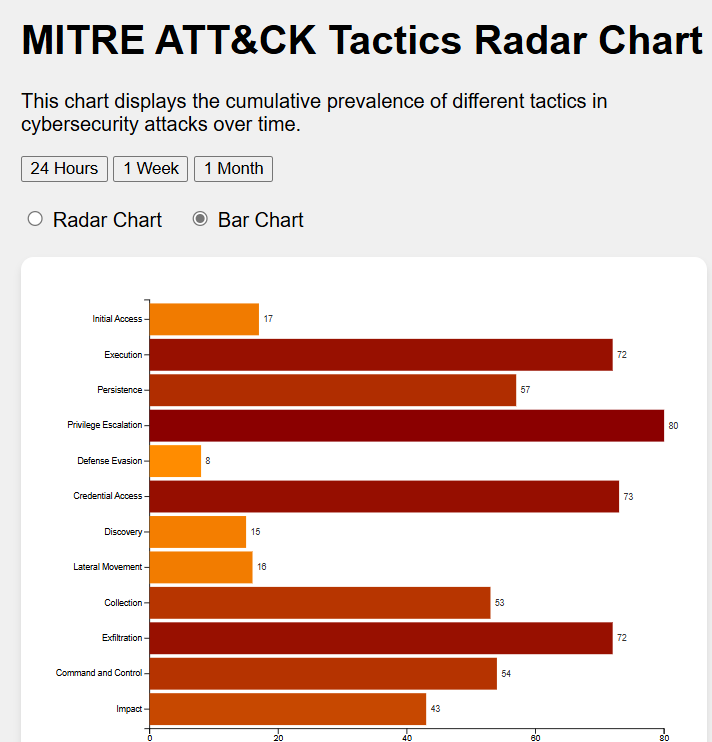

# Jumped the Shark

Ok...so at this point the graph is getting a bit less useful. Truely we have jumped the shark.

I would say where we left off at 08 was perfect. But lets fix up this a little more and call it

Code: https://jsfiddle.net/624ocLhy/11/

## Prompt

its looking good
in the bar charts I need
the horizontal labels on left are cut off. maybe start the chart a bit to the right
in the bar chart I would like to see the value to the left ( or whatever is best practice)

surprise me with other things if you can easily do them

## Result



I'm glad to hear your radar and bar charts are looking good! Let's address the issues you've mentioned with the bar chart and enhance it further. Here's a step-by-step guide to make the necessary adjustments:

1. **Preventing Labels from Being Cut Off:**

   - **Issue:** The y-axis labels (tactic names) on the left are being cut off because there's not enough space allocated for them.
   - **Solution:** Increase the left margin by adjusting the `translate` value of the `barGroup` and modifying the `xScaleBar` range accordingly.

2. **Displaying Values Next to the Bars:**

   - **Issue:** You want to display the numerical value of each bar for better readability.
   - **Solution:** Add text elements to display the value either inside or next to each bar.

3. **Additional Enhancements:**
   - **Improved Margins:** Define a margins object to manage chart spacing more effectively.
   - **Responsive Design:** Ensure the chart adjusts gracefully to different screen sizes.
   - **Enhanced Tooltip Styling:** Make tooltips more visually appealing.
   - **Smooth Transitions:** Improve the transition effects when switching between charts or updating data.

Below is the updated code with these improvements:

### Updated HTML and CSS

No changes are required in the HTML and CSS sections for these specific adjustments. However, ensure that your CSS has sufficient padding and styling for the tooltip and other elements.

### Updated JavaScript

### Explanation of Changes

1. **Adjusted Margins for the Bar Chart:**

   - Defined a `margins` object to manage the spacing around the bar chart.
   - Updated the `barGroup` translation to `translate(${margins.left}, ${margins.top})`.
   - Adjusted the `xScaleBar` range to account for the new left and right margins.

   ```javascript
   const margins = { top: 50, right: 50, bottom: 50, left: 150 };

   const barGroup = svg
     .append("g")
     .attr("id", "bar-group")
     .attr("transform", `translate(${margins.left}, ${margins.top})`)
     .style("display", "none"); // Hide bar chart initially

   const xScaleBar = d3
     .scaleLinear()
     .range([0, width - margins.left - margins.right]); // Adjusted for margins
   ```

2. **Added Value Labels to the Bars:**

   - After drawing the bars, appended `text` elements to display the value of each bar.
   - Positioned the labels slightly to the right of the bars for better visibility.

   ```javascript
   // Add value labels to the bars
   barGroup
     .selectAll(".bar-label")
     .data(data)
     .enter()
     .append("text")
     .attr("class", "bar-label")
     .attr("y", (d) => yScaleBar(d.label) + yScaleBar.bandwidth() / 2)
     .attr("x", (d) => xScaleBar(d.value) + 5) // Position to the right of the bar
     .attr("dy", "0.35em")
     .attr("fill", "#333")
     .attr("font-size", "10px")
     .text((d) => d.value)
     .style("opacity", 0)
     .transition()
     .delay(1000)
     .duration(500)
     .style("opacity", 1);
   ```

3. **Improved Tooltip Styling:**

   - Ensured the tooltip appears smoothly and doesn't interfere with other elements.
   - You can further enhance the tooltip styling in your CSS if desired.

4. **Preventing Redundant Chart Updates:**

   - Added a condition to prevent unnecessary updates if the selected chart type is already active.

   ```javascript
   function toggleChart(chartType) {
     if (chartType === currentChartType) return; // No change

     currentChartType = chartType;

     if (chartType === "radar") {
       radarGroup.style("display", null);
       barGroup.style("display", "none");
     } else {
       radarGroup.style("display", "none");
       barGroup.style("display", null);
     }
     updateChart(currentTimeframe);
   }
   ```

### Additional Recommendations

1. **Responsive Design Enhancements:**

   - Although the SVG is set to be responsive with `viewBox` and `preserveAspectRatio`, ensure that the container (`#chart`) has a flexible width to adapt to different screen sizes.

2. **Enhanced Color Scales:**

   - Consider using a more nuanced color scale or incorporating color legends to make the color differences more meaningful.

3. **Interactive Features:**

   - Add interactivity such as filtering specific tactics or comparing multiple timeframes simultaneously.

4. **Accessibility Considerations:**

   - Ensure that color choices are accessible to users with color vision deficiencies.
   - Add ARIA labels or other accessibility features to improve usability.

5. **Performance Optimization:**
   - If dealing with larger datasets, consider performance optimizations like throttling updates or using canvas instead of SVG for rendering.

### Final Thoughts

By adjusting the margins and adding value labels, your bar chart should now display all labels correctly without cutting them off and provide clear numerical values alongside each bar. Feel free to experiment with additional enhancements to further improve the user experience and visual appeal of your charts.

If you encounter any issues or have further questions, feel free to ask!
