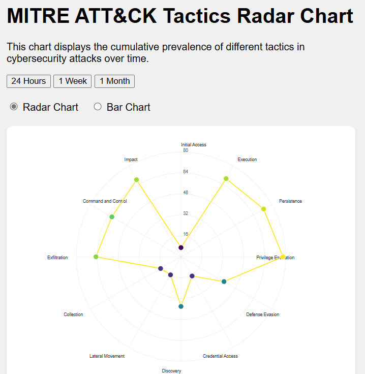
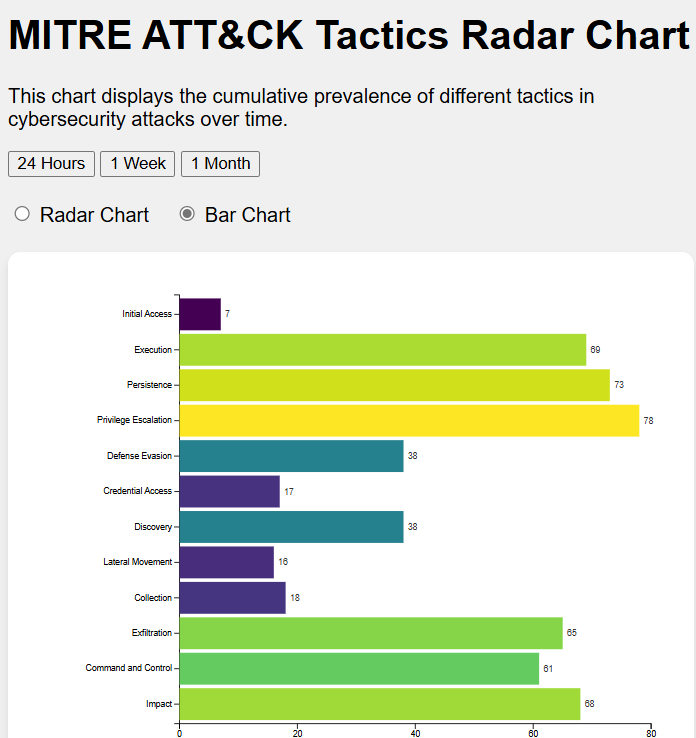

# Fix Palette

Im calling it.  But first the colors need a tweak

Code: <https://jsfiddle.net/624ocLhy/12/>

### Prompt

## Result

 

 

Great! Let's enhance your bar chart by implementing a more nuanced color scale with a cooler palette. We'll use D3's perceptually uniform color schemes, such as `interpolateViridis`, `interpolatePlasma`, or `interpolateCool`, which provide smooth gradients and are aesthetically pleasing.

Additionally, we'll add a color legend to help interpret the color scale and ensure that all labels are displayed correctly without being cut off.

Here's how you can achieve this:

### Updated JavaScript Code

 < see code >

### Updated CSS

To accommodate the legend and ensure proper spacing, you might need to adjust your CSS slightly. Here's the updated CSS with minimal changes:
< see code >

### Explanation of Changes

1. **Cooler and More Nuanced Color Scale:**
    - **Color Interpolator:** Switched from a linear orange/red scale to `d3.interpolateViridis`, which provides a perceptually uniform and aesthetically pleasing color palette ranging from blue to green.
    - **Sequential Scale:** Changed the `colorScale` to a sequential scale using `d3.scaleSequential` with the chosen interpolator.

    ```javascript
    // Define colorScale dynamically based on current data range using Viridis
    colorScale = d3.scaleSequential()
        .domain([minValue, maxValueInData])
        .interpolator(d3.interpolateViridis);
    ```

    **Alternative Interpolators:**
    - `d3.interpolatePlasma`
    - `d3.interpolateCividis`
    - `d3.interpolateCool`

    Feel free to experiment with these to find the palette that best fits your needs.

2. **Increased Left Margin for Bar Chart:**
    - **Purpose:** Prevent y-axis labels from being cut off by increasing the left margin.
    - **Change:** Updated the `margins` object and set `left: 200` to provide ample space for longer labels.

    ```javascript
    const margins = { top: 50, right: 50, bottom: 50, left: 200 };
    ```

3. **Color Legend:**
    - **Purpose:** Helps users understand the mapping between color intensity and values.
    - **Implementation:** Added a `addColorLegend` function that creates a gradient legend below the bar chart.

    ```javascript
    // Function to add a color legend
    function addColorLegend(colorScale, xScale, maxValue) {
        // Remove existing legend
        barGroup.selectAll(".legend").remove();

        const legendWidth = 200;
        const legendHeight = 10;

        // Append a group for the legend
        const legendGroup = barGroup.append("g")
            .attr("class", "legend")
            .attr("transform", `translate(0, ${height - margins.top - margins.bottom + 40})`);

        // Define a gradient
        const defs = svg.append("defs");

        const linearGradient = defs.append("linearGradient")
            .attr("id", "linear-gradient");

        linearGradient
            .attr("x1", "0%")
            .attr("y1", "0%")
            .attr("x2", "100%")
            .attr("y2", "0%");

        // Set the color for the start (0%)
        linearGradient.append("stop")
            .attr("offset", "0%")
            .attr("stop-color", colorScale.range()[0]);

        // Set the color for the end (100%)
        linearGradient.append("stop")
            .attr("offset", "100%")
            .attr("stop-color", colorScale.range()[1]);

        // Draw the rectangle and fill with gradient
        legendGroup.append("rect")
            .attr("width", legendWidth)
            .attr("height", legendHeight)
            .style("fill", "url(#linear-gradient)")
            .style("stroke", "#ccc")
            .style("stroke-width", 1);

        // Define scale for x-axis of the legend
        const legendScale = d3.scaleLinear()
            .domain(colorScale.domain())
            .range([0, legendWidth]);

        // Define and draw the x-axis for the legend
        const legendAxis = d3.axisBottom(legendScale)
            .ticks(5)
            .tickFormat(d3.format("d"));

        legendGroup.append("g")
            .attr("transform", `translate(0, ${legendHeight})`)
            .call(legendAxis);
    }
    ```

4. **Adjusted Legend Positioning:**
    - **Purpose:** Position the legend appropriately below the bar chart without overlapping.
    - **Change:** Translated the legend group to `translate(0, ${height - margins.top - margins.bottom + 40})`.

5. **Enhanced Tooltip Styling:**
    - **Purpose:** Ensure tooltips are clear and do not obstruct important parts of the chart.
    - **Change:** The tooltip styling in CSS remains the same, but you can further customize it as needed.

6. **Responsive Design Considerations:**
    - **SVG Scaling:** The `viewBox` and `preserveAspectRatio` attributes ensure that the SVG scales appropriately across different screen sizes.
    - **Container Flexibility:** Ensure that the `#chart` container has a flexible width to adapt to various screen sizes.

### Final Recommendations

1. **Experiment with Different Color Schemes:**
    - D3 offers a variety of color interpolators. Feel free to try different ones to see which best fits your visualization needs.

    ```javascript
    // Example with Plasma
    colorScale = d3.scaleSequential()
        .domain([minValue, maxValueInData])
        .interpolator(d3.interpolatePlasma);
    ```

2. **Add a Color Legend to the Radar Chart:**
    - Similar to the bar chart, adding a legend to the radar chart can enhance interpretability.

3. **Implement Responsiveness:**
    - Although the SVG scales, consider adjusting font sizes and element sizes based on screen width for better readability on smaller devices.

4. **Accessibility Considerations:**
    - Ensure that color choices are accessible to users with color vision deficiencies. Tools like [Color Oracle](https://colororacle.org/) can help test your color schemes.
    - Consider adding patterns or textures in addition to color to differentiate elements.

5. **Performance Optimization:**
    - If dealing with larger datasets, consider optimizing transitions and rendering methods to maintain performance.

6. **Interactivity Enhancements:**
    - Add features like filtering specific tactics, highlighting selected elements, or comparing multiple timeframes simultaneously to provide deeper insights.

### Updated JSFiddle

To implement these changes, you can update your JSFiddle with the provided JavaScript and CSS code. Here's the [updated JSFiddle link](https://jsfiddle.net/624ocLhy/12/) for your reference.

**Note:** Ensure that you replace the JavaScript and CSS sections in your JSFiddle with the updated code provided above.

### Conclusion

By implementing a more nuanced and cooler color scale using D3's `interpolateViridis` and adding a color legend, your bar chart will not only look more visually appealing but also provide better clarity to the users. These enhancements improve both the aesthetics and the functionality of your data visualization.

Feel free to experiment further with different color schemes and interactive features to tailor the charts to your specific needs. If you have any more questions or need further assistance, feel free to ask!
