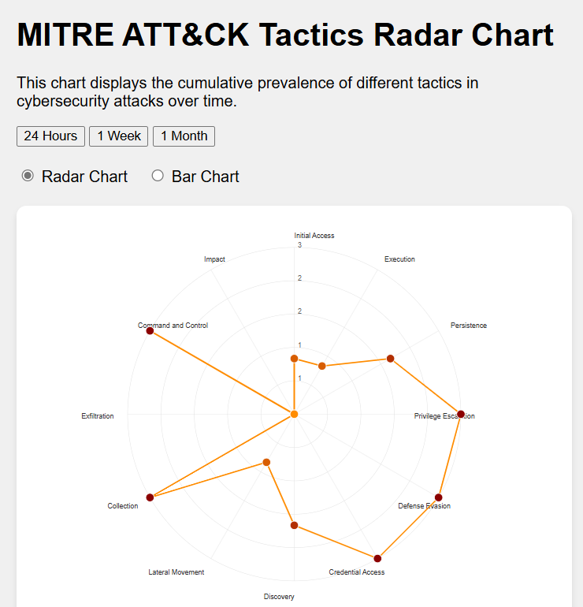

# d3-mitre-ai-experiment

## Overview

An experiment to see how well the current LLM models do with creating D3 visualizations.
Note, this is 10/2024.  In a year it will already be outdated!

The goal is to attempt to write as LITTLE code as possible. If something needs fixing, work it in the prompt.

Im using a combination of Claude (3.5), and ChatGPT O1-mini/o-preview.  Im paying for GPT, but figured I would run out my allotment of Sonnet prompts first just to see how well that goes.

I will be needing some Widgets in a bit and we have crafted our own before.  I think the requirements call for just a pie chart.  I think we can do better. I have never tried a radar chart, which is NOT where we need to be going...but hey, its an experiment right?

## Preliminary work

At first I thought I would consult with o1-preview for an outline.

[Initial request overview](00-01-initial-request.md)

Ok...wow...5 weeks!  5 Weeks cant be right. Im hoping 2 hours or so.

Lets ask for a preview

[Create me a preliminary visualization](00-02-dalle-request.md)

Oh dear.
That is not what I expect from D3 at all. I think I will start fresh with a small set of requirements.

## First Prompts

So I did a little research to get the tactics for Mitre. Mostly to get the 11 or so tactics to start with. This was a basic create a radar graph prompt.

[First Prompt](00-first-graph/readme.md)

Ok...decent start. Looks wonky. Lets fix the obvious labels.

[Fix the labels](01-fix-labels/readme.md)

Divider lines are a bit much

[Fix the missing line](02-fix-lines/readme.md)

## Polish

Manual asks for improvements

[Better labels and Tooltips](03-tooltips/readme.md)

Lets make better divider lines

[Divider lines](04-divlines-polish/readme.md)

## Just ask for more

A very simple ask to improve without anything in mind

[Make Better](05-mo-betta/readme.md)

## More Datasets

Lets add data. 24 hours, 1 week, 1 month

[3 datasets](06-datasets/readme.md)

Normalize the data a bit

Lets add data. 24 hours, 1 week, 1 month

[Normalize](07-normalize/readme.md)

## Bring on ChatGPT Preview

So at this point, my free claude promts ran out. Lets move on to o1-preview.
Overkill.

One thing I noticed is that when just using the whole thing as its given, features disapper.
Its kinda like a regular ChatGPT thing where you ask for one little change and it rewrites the whole thing.

Im told canvas might do this better, but really....what I should be doing is looking at the code more.
Im just looking at the working graph and saying..."wow, works! Next!"

[Fix things](08-chat1/readme.md)

## Two Two Two graphs in one

Gimme a toggle and bar chart

[Bar](09-combo/readme.md)

Transitions are broke again

[Transitions](10-transitions/readme.md)

## jumped the shark

Add some labels and final polish.  But...this is kinda a hot mess.  I should have stuck to one graph

[Final fixes](11-jump/readme.md)

Transitions are broke again

[Fix Palette](12-palette/readme.md)

and thats a wrap.

Well.  What did we learn

you can effective create D3 graphs with zero code writing.  i never micro edited a single line

you really should understand whats going on so you can ask focused questions. Otherwise a new feature rewrites things.
This might blast previous things.

This took about 90 mins.  Althought i took  a lot of notes and capturing that was just as long!!
