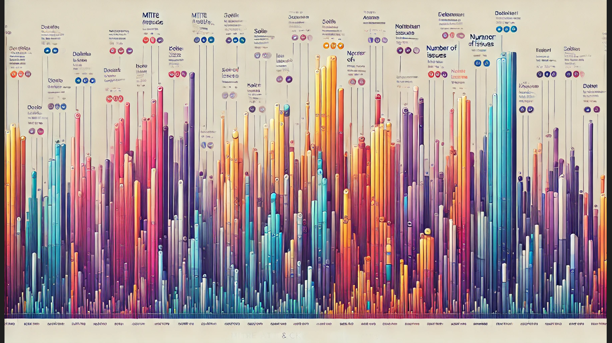
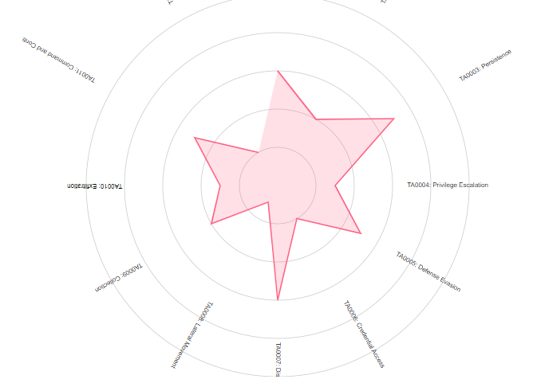

# d3-mitre-ai-experiment

# Overview
An experiment to see how well chat handles d3 things.

Attempt to write as LITTLE code as possible.  If something needs fixing, work it in the prompt.

Im using a combination of Claude, perplexity and ChatGPT O1-mini.

[Initial request ovreview](00-01-initial-request.md)

Ok...wow...5 weeks.  Im hoping 2 hours.  

Lets ask for a preview.  in Dalle.

[Initial request ovreview](00-02-dalle-request.md)

oh dear.
Well...lets plod on.

# First Prompt

So I did a little research to get the tactics for Mitre.

[First Prompt](00-first-graph/first-graph.md)

Ok...decent start
