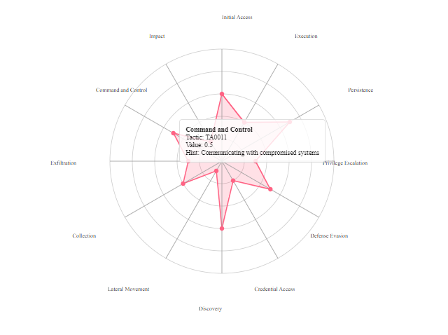

# d3-mitre-ai-experiment

# Overview
An experiment to see how well Chat models do with creating D3 visualizations.

The goal is to attempt to write as LITTLE code as possible.  If something needs fixing, work it in the prompt.

Im using a combination of Claude, and ChatGPT O1-mini/o-preview.

At first I thought I would consult with o1-preview for an outline.

[Initial request overview](00-01-initial-request.md)

Ok...wow...5 weeks.  Im hoping 2 hours or so.  

Lets ask for a preview

[Create me a preliminary visualization](00-02-dalle-request.md)

Oh dear.
Well...lets plod on.  I think I will start fresh with a small set of requirements.

# First Prompts

So I did a little research to get the tactics for Mitre. Mostly to get the 11 or so tactics to start with.  This was a basic create a radar graph prompt.

[First Prompt](00-first-graph/first-graph.md)

Ok...decent start.  Looks wonky.  Lets fix the obvious labels.

[Fix the labels](01-fix-labels/fix-labels.md)

Divider lines are a bit much

[Fix the missing line](02-fix-lines/lines.md)

# Polish

[Better labels and Tooltips](03-tooltips/tooltips.md)

