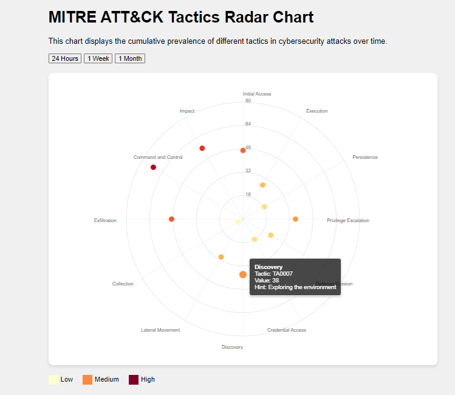
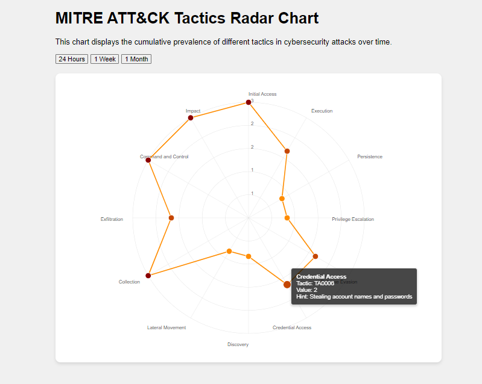
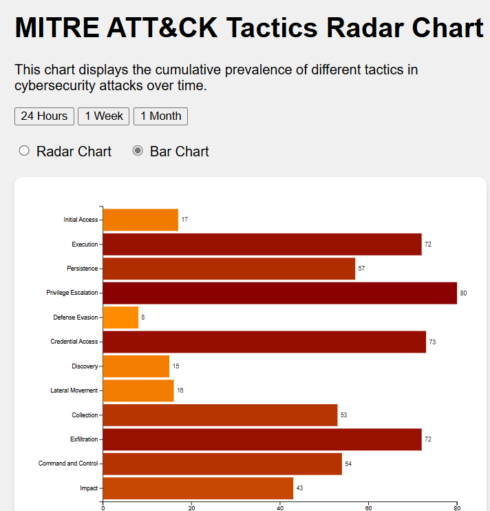

# d3-mitre-ai-experiment

## Overview

An experiment to see how well Chat models do with creating D3 visualizations.

The goal is to attempt to write as LITTLE code as possible. If something needs fixing, work it in the prompt.

Im using a combination of Claude, and ChatGPT O1-mini/o-preview.

At first I thought I would consult with o1-preview for an outline.

[Initial request overview](00-01-initial-request.md)

Ok...wow...5 weeks. Im hoping 2 hours or so.

Lets ask for a preview

[Create me a preliminary visualization](00-02-dalle-request.md)

Oh dear.
Well...lets plod on. I think I will start fresh with a small set of requirements.

## First Prompts

So I did a little research to get the tactics for Mitre. Mostly to get the 11 or so tactics to start with. This was a basic create a radar graph prompt.

[First Prompt](00-first-graph/first-graph.md)

Ok...decent start. Looks wonky. Lets fix the obvious labels.

[Fix the labels](01-fix-labels/fix-labels.md)

Divider lines are a bit much

[Fix the missing line](02-fix-lines/lines.md)

## Polish

Manual asks for improvements

[Better labels and Tooltips](03-tooltips/tooltips.md)

Lets make better divider lines

[Divider lines](04-divlines-polish/polish.md)

## Just ask for more

A very simple ask to improve without anything in mind

[Make Better](05-mo-betta/better.md)

## More Datasets

Lets add data. 24 hours, 1 week, 1 month

[3 datasets](06-datasets/datasets.md)

Normalize the data a bit

Lets add data. 24 hours, 1 week, 1 month

[Normalize](07-normalize/normalize.md)

## Bring on ChatGPT Preview

So at this point, my free claude promts ran out. Lets move on to o1-preview.
Overkill.

One thing I noticed is that when just using the whole thing as its given, features disapper.
Its kinda like a regular ChatGPT thing where you ask for one little change and it rewrites the whole thing.

Im told canvas might do this better, but really....what I should be doing is looking at the code more.
Im just looking at the working graph and saying..."wow, works! Next!"

[Fix things](08-chat1/chat.md)

## Two Two Two graphs in one

Gimme a toggle and bar chart

[Bar](09-combo/title.md)

Transitions are broke again

[Transitions](10-transitions/transitions-bar.md)

## jumped the shark

Add some labels and final polish.  But...this is kinda a hot mess.  I should have stuck to one graph

[Final fixes](11-jump/jump.md)

Transitions are broke again

[Fix Palette](12-palette/palette.md)

and thats a wrap.

Well.  What did we learn

you can effective create D3 graphs with zero code writing.  i never micro edited a single line

you really should understand whats going on so you can ask focused questions. Otherwise a new feature rewrites things.
This might blast previous things.

This took about 90 mins.  Althought i took  a lot of notes and capturing that was just as long!!